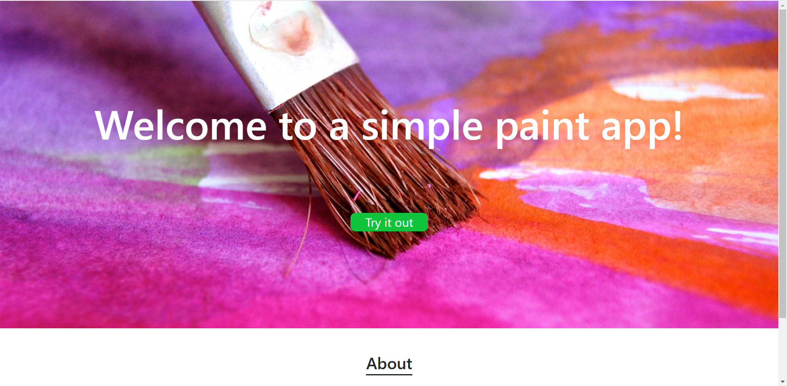
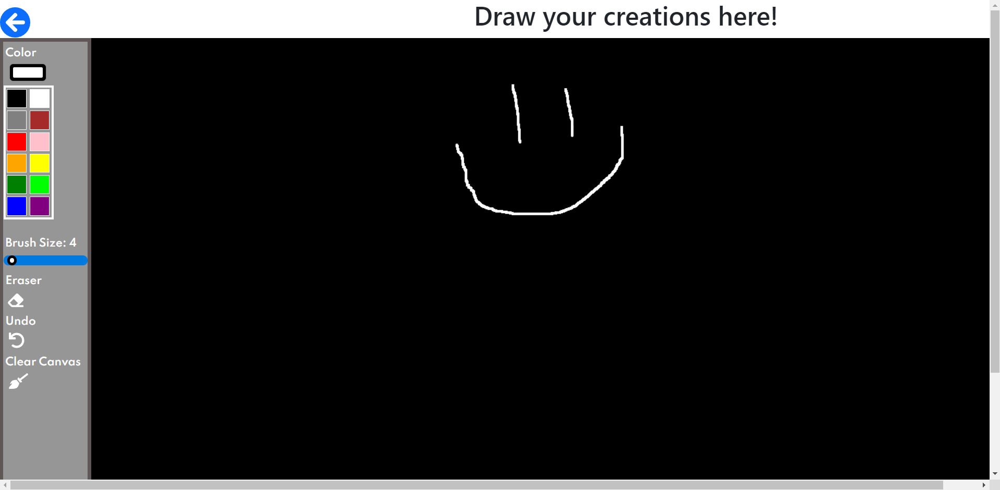

# [**Paint**](https://blissful-bassi-ede06c.netlify.app/)

Paint is a react app that allows users to draw on screen using their mouse by creating free-form lines. You can choose from thousands of colors and adjust your tool size.


## Landing Page


## Canvas


# Installation

## System Requirements
**Node 5.2+**
<br>

### Cloning the app

This app can be installed by cloning from this repository:
```
https://github.com/rzh150030/paint-app.git
```

Cd into the newly cloned folder and install all dependencies using this command:
```
npm install
```

To start the app and run the live server use this command:
```
npm start
```
<br>

## Deployment

This app was deployed using Netlify. Create an account on Netlify and start by adding a new project your account.

1. First push the local repo to GitHub and then link Netlify to GitHub.

2. Authorize Netlify to access your GitHub account and then select the repo containing the Paint App project.

3. Configure the options and make sure your public site files are placed after building the site and your build command is whatever you run to build the site (e.g. `npm run build`).

4. Click deploy site button and wait for Netlify to finish building the site.

5. Once the build completes, the site is live. Site url can be found in the overview and pushes to the main branch on GitHub will update onto the live site.

## Tech Used
React.js React-Router React-Color React-CSS Font-Awesome

## Developers

[Richard Huang](https://github.com/rzh150030)

[Roger Zavala](https://github.com/Rzavala414)
