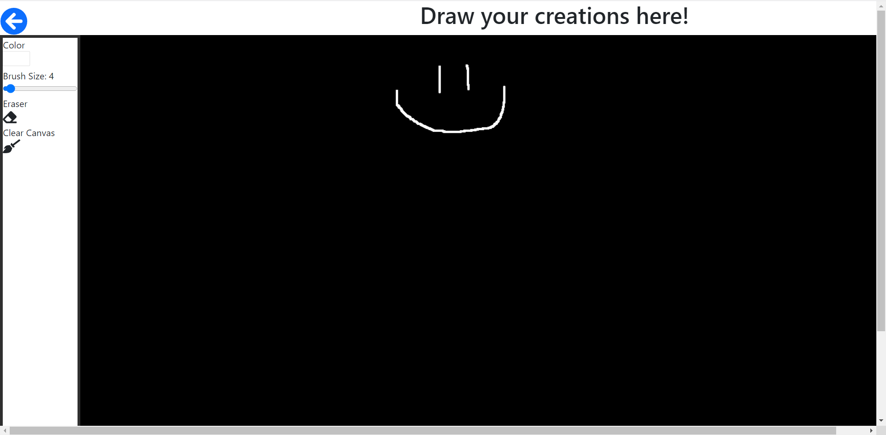

# Paint App

Paint App is a simple app built with react that allows users to draw picture using their mouse to create free-form lines. You can select the color of your brush and size of your brush to create larger lines when drawing.

[live site](https://blissful-bassi-ede06c.netlify.app/)

## Landing Page

## Main App

## Development

This project was bootstrapped with [Create React App](https://github.com/facebook/create-react-app).

### Cloning the app

This app can be installed by cloning from this repository:
`https://github.com/rzh150030/paint-app.git`

Install all dependencies using this command:
`npm install`

In the project directory, you can run:
`npm start`

Runs the app in the development mode.\
Open http://localhost:3000 to view it in the browser.

The page will reload if you make edits.\
You will also see any lint errors in the console.

### Develop from Scratch

Make sure to have node package manager 5.2+ installed on your system.

Run the command `npx create-react-app paint-app`.

Enter the folder using the command `cd paint-app`.

Install react-router-dom and with npm install.

Install Font Awesome icons using these commands.
`npm install --save @fortawesome/fontawesome-svg-core`
`npm install --save @fortawesome/free-solid-svg-icons`
`npm install --save @fortawesome/react-fontawesome`

Add this link tag to the header in public/index.html

`<link href="https://cdn.jsdelivr.net/npm/bootstrap@5.1.3/dist/css/bootstrap.min.css" rel="stylesheet" integrity="sha384-1BmE4kWBq78iYhFldvKuhfTAU6auU8tT94WrHftjDbrCEXSU1oBoqyl2QvZ6jIW3" crossorigin="anonymous">`

## Deployment

This app was deployed using Netlify. Create an account on Netlify and start by adding a new project your account.

1. First push the local repo to GitHub and then link Netlify to GitHub.

2. Authorize Netlify to access your GitHub account and then select the repo containing the Paint App project.

3. Configure the options and make sure your public site files are placed after building the site and your build command is whatever you run to build the site (e.g. `npm run build`).

4. Click deploy site button and wait for Netlify to finish building the site.

5. Once the build completes, the site is live. Site url can be found in the overview and pushes to the main branch on GitHub will update onto the live site.

## Developers

[Richard Huang](https://github.com/rzh150030)

[Roger Zavala](https://github.com/Rzavala414)
